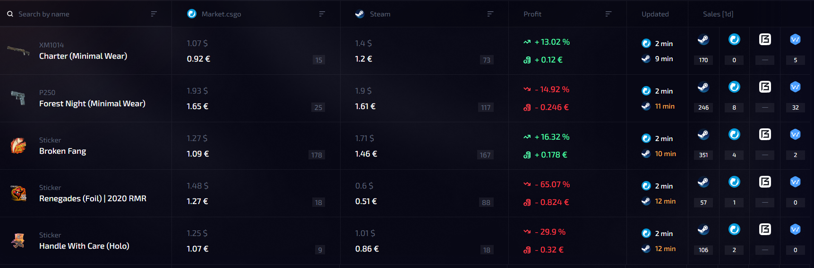
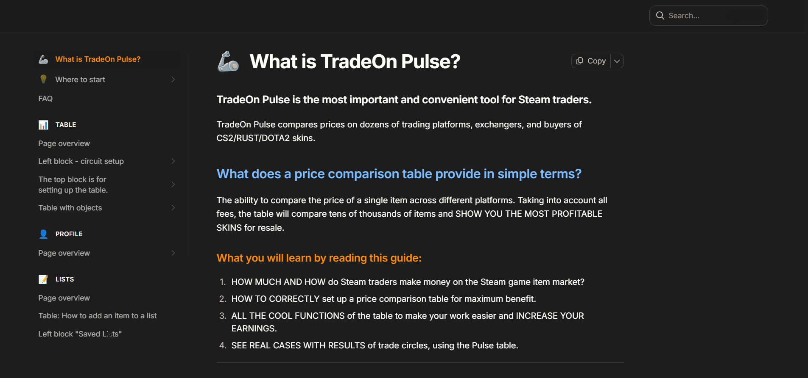

# Surpise-Project

# CS2 Skin Price Tracker

## Description

CS2 Skin Price Tracker is a simple frontend tool that compares CS2 skin prices across multiple marketplaces in one place.

Instead of manually checking Steam Market, Skinport, Waxpeer, DMarket, and other sites, the project loads all prices from a local JSON file and displays them side by side so you can quickly find the best deal.

The goal is to make CS2 skin trading faster and easier by removing the need to switch between multiple websites.

---

## Idea

When buying or selling CS2 skins, you usually need to open several marketplaces just to compare prices. This process is slow and repetitive.

This project solves that problem by storing all marketplace prices in a single JSON file and showing them in a clean, easy-to-read comparison table.

---

## What it does

- Search any CS2 skin  
- Compare prices across multiple marketplaces  
- Display all results in one table  
- Highlight the best price automatically  
- Load data from a local JSON file  
- Show last updated time for price freshness  

---

## Demo

### Price comparison table

### Instructions / overview

---

## Supported marketplaces

- Steam Market  
- Skinport  
- Market.csgo  
- CsFloat  

---

## Tech stack

| Technology  | Usage |
|------------|------|
| HTML / CSS | UI |
| JavaScript | Frontend logic |
| JSON file  | Data storage (prices) |

---

## How it works

All skin prices are stored in a local JSON file inside the project.

The frontend reads this file and renders the data in a comparison table.

Because everything is static, the project is fast, simple, and can be hosted on any static hosting service like GitHub Pages.

---

## Goal

The goal of this project is to simplify CS2 skin price comparison by showing all marketplaces in one place.